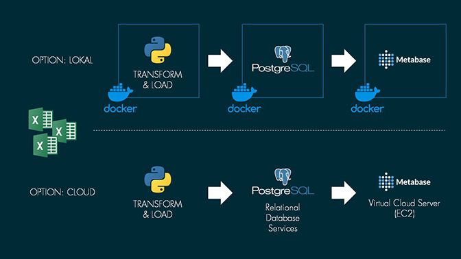

# From excel to interactive online dashboard

Making beverage sales data become accesible without extra software costs

## Background of the project

The power of data is often not accesible in smaller companies, due to missing knowledge and/or tools. Data insights for sales agents are hidden within multiple excel sheets managed by finance and accounting teams. The no-cost solution: Using metabase for visualization of interactive sales dashboards.

This project was conducted in April 2023 for a small beverage company as an one week prototype to evaluate the benefits against time invest. Randomized sample data is provided for presentation purposes. 

This repository provides the main parts of the project code to extract and transform excel based data, load a postgreSQL database and finally start visualizing the data within metabase. Using docker, the steps are operating system independant. The same code can be easily adapated for online accesable dashboards using Cloud services.

## The Code

This project is coded in Python 3.9.

- [/docker_files](./docker_files) include the sample data and functions.py to run the ETL script within the docker-compose.yml. Simply build and up with docker compose.
- [/pictures_and_impressions](./pictures_and_impressions) include graphics of this readme, some EDA Insights of the real data and impressions of the dashboards. 

## Data

The sample data is pseudonymized due to sensitivity reasons. The tables were reduzed in dimension and values are randomized and fake.

## Use of code and data

Further details are available in the code license.

